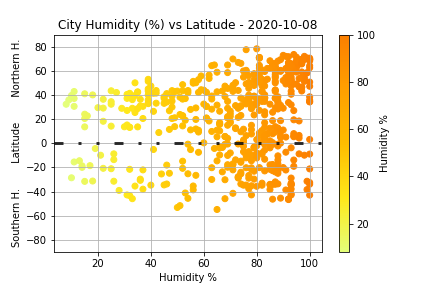
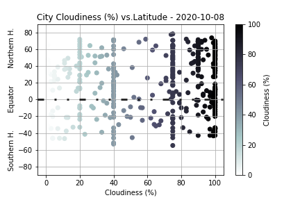
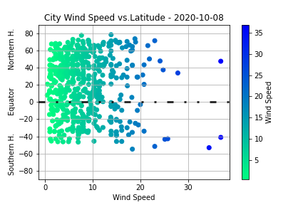

# What's the Weather Like? - Python API Homework <!-- omit in toc -->

For Findings, please click on the findings section of the table of contents

- [Background](#background)
  - [WeatherPy - An analysis of weather data as it related to latitude](#weatherpy---an-analysis-of-weather-data-as-it-related-to-latitude)
  - [VacationPy - Planning future vacations based off of the weather data.](#vacationpy---planning-future-vacations-based-off-of-the-weather-data)
- [Findings](#findings)
  - [WeatherPy Results](#weatherpy-results)
    - [Temperature of Cities vs Latitude Thoughts](#temperature-of-cities-vs-latitude-thoughts)
    - [Humidity of Cities vs Latitude Thoughts](#humidity-of-cities-vs-latitude-thoughts)
    - [Cloudiness of Cities vs Latitude Thoughts](#cloudiness-of-cities-vs-latitude-thoughts)
    - [Wind Speed of Cities vs Latitude Thoughts](#wind-speed-of-cities-vs-latitude-thoughts)
    - [Linear Regression - Temperature by Hemisphere](#linear-regression---temperature-by-hemisphere)
    - [Linear Regression - Humidity by Hemisphere](#linear-regression---humidity-by-hemisphere)
    - [Linear Regression - Cloudiness by Hemisphere](#linear-regression---cloudiness-by-hemisphere)
    - [Takeaways from Results of WeatherPy](#takeaways-from-results-of-weatherpy)
  - [VacationPy Results](#vacationpy-results)
  - [Here are the 9 Cities and the closet hotels:](#here-are-the-9-cities-and-the-closet-hotels)

## Background

### WeatherPy - An analysis of weather data as it related to latitude

In this assignment I was to look at data regarding weather and see if the city location's latitude and longitude had any impact on the weather it faced.

1. More specifically, the first objective's foal was to determine if four different weather phenonemon - temperature, humidity, cloudiness, and wind speed - were directly related to how close they were to the equator.

2. The next objective was to run a linear regression on each of the four different phenonmenon, but to split it out into Northern Hemisphere and Southern Hemisphere data. The results would be:

   - Northern Hemisphere - Temperature (F) vs. Latitude
   - Southern Hemisphere - Temperature (F) vs. Latitude
   - Northern Hemisphere - Humidity (%) vs. Latitude
   - Southern Hemisphere - Humidity (%) vs. Latitude
   - Northern Hemisphere - Cloudiness (%) vs. Latitude
   - Southern Hemisphere - Cloudiness (%) vs. Latitude
   - Northern Hemisphere - Wind Speed (mph) vs. Latitude
   - Southern Hemisphere - Wind Speed (mph) vs. Latitude

3. After each pair of plots, I will explain what the linear regression is modelling such as any relationships and any other analyis I might have.

4. Considerations for this analysis included the following:

- Randomly selecting at least 500 unique cities based on latitiude and longtiude.
- Performing a weather check in each of the cities using a series of sucessive API calls.
- Including a print log of each city as it's being processed with the city name and number
- Saving a CSV of retrieved data and and PNG image of each scatter plot.

### VacationPy - Planning future vacations based off of the weather data.

In the next art of the assignment, I took the weather data from above and used jupyter-gmaps and the Google Places API to identify
cities with "perfect weather".

1.  I created a heat map that displayed the humidity for every city from Pari I of the assignment.

2.  I narrowed down the DataFrame to find my ideal weather conditions. These conditions were:

    - A maximum temperature lower than 80 degrees but higher than 70 degrees.
    - A wind speed less than 10 mph
    - Zero Cloudiness

3.  This brought down the number of cities to a reasonable number.
4.  Take these cities and plot the first hotel within 5000 meters of the city.
5.  This plot would be on top of the hjumidity heatmap with each pin containing:

    - Hotel Name
    - City
    - Country

## Findings

### WeatherPy Results

Here are the results of the WeatherPy analysis and my thoughts associated with each chart.

#### Temperature of Cities vs Latitude Thoughts

For this chart along with the following three charts, over 600 cities were selected based off of their proximity to a latitude and longitude number randomly chosen. While each chart represents a different scatterplot, the overall concept is the same (Meteorological Condition vs. Latitude)

I modified the charts from the original sample given to us to hopefully provide a little more color commentary to the data. These will be the focus of our discussion in the next four blurbs.

You will notice that i used the temperature variable rather than the max_temp variable. The max temperature is actually saying: give me all the weather stations for that city. Now tell me, "What is the maximum value for temperature at that time?" Likewise, minimum temperature is calculated the same. I will have more to say on this after wind speed vs latitude scatterplot.

#### Humidity of Cities vs Latitude Thoughts

In the sample charts provided, latitude was the x-axis variable. This runs counter-intuitive to our thinking spatially regardins maps of the world. If we were to look at a map of the world or at a globe or map of the world, chances are we see the equator perpendicular to the y-axis. I flipped the axes so that we can view the results in a similar format.

#### Cloudiness of Cities vs Latitude Thoughts

In each of the four charts, I enhanced the way the data is portrayed by using colormaps. In matplotlib, one of my favorite ways to bring a little more color commentary (no pun intended) to a chart is to use colormaps. There are a wide variety of colormaps avialable. Each colormap I chose was relaetd to the data at hand.

- For the temperature scatterplot, I chose the colormap "coolwarm". This allows colders temperatures in blue along with warmer temperatures in red.
- For the humidity scatterplot, I chose the colormap "Wistia". This colormap is yelllow to orange which are colors often associate with warmth. While humidity is certainly not the primary factor of warmth, it certainly a secondary factor as anyone living in Austin in June can attest.
- For the cloudiness scatterplot, I chose the colormap "bone". Bone, in reverse, allows us to have a gradient which gives us almost translucent data points for little cloud cover to opaque black data points for total cloud coveage.
- For the wind speed scatterplot, I chose the colormap "winter". Winter typically has bone-jarring winds with strong cold fronts from either Polar or Arctic vortices.

#### Wind Speed of Cities vs Latitude Thoughts

So why are there minimum and maximum temperature data points provided for each city, especially if they aren't the daily minimum and mmaximum temperatures?
Many coastal cities with hilly basins are subject a condition called microclimates. San Francisco is a prime example of this occurring. Mark Twain never said it, but there is a quote that states, "The coldest winter I ever spent was a summer in San Francisco."
On a typical Wednesday in June at 3PM, depending on where you were at in the city, the temperature you would feel could wildly different.

- You could be at Oracle Park in China Basin enjoying a Giants game during the day. It's sunny, 80 degrees.
- You could be in Glen Park shielded by the straight line coastal wind, but experience a temperature in the 60s.
- Or you could be visiting the Sutro Bath ruins on the Pacific Coast. Temperature there? 52 degrees.

On this day at this time, you might see the following conditions:

- Temperature - 64 degrees
- Maximum Temperature - 80 degrees
- Minimum Temperature - 52 degrees

#### Linear Regression - Temperature by Hemisphere

_2020-10-08.png>)
_2020-10-08.png>)

There appears to be a direct correlation between temperature and the latitude of the city, especially when it came to the Northern Hemisphere where the slope is -1. The slope is a little bit less in the southern hemisphere (-0.73) \ Perhaps the differnce can be attributed toa lot less land, and subsequently less cities in the Southern Hemisphere. Additioanlly except for near Tierra del Fuego, Antartica is an ocean away from any other land. In other words there are basically open seas past 55 degrees South, which does not alllow perhaps closer relationship between Temperature and latitude.

#### Linear Regression - Humidity by Hemisphere

_2020-10-08.png>)
_2020-10-08.png>)

There is what seems to be a small correlaton between Humidity and the Northern Hemisphere. But because there is virtually no correlation in the Southern Hemipshere, I would say we need additional analysis to determine if it exists. My alternative hypothesis is that humidity is more associated with ocean temperatures along with the wind that drive weather patterns and where they come from.

#### Linear Regression - Cloudiness by Hemisphere

_2020-10-08.png>)
_2020-10-08.png>)

This is a challenging analysis to perform. I would even venture to say that it was not set up in a way to make any conclusions. Cloudiness is more of a subjective variable based on a meterologist's observations. Additionally, the varible is rounded to the near tenth(%), which does not give great scatter.

#### Takeaways from Results of WeatherPy

Here are my three takeaways related to the analyzing of the meteorological data:

- There is a direct correlation between temperature and latitude.
  - In the Northern Hemisphere, for every degree of latitude we add, we take away a degree of temperature (y = -1.0x + 108.22).
  - In the Southern Hemishpere, the slope is a little less (y = -0.73x + 68.12)
- Looking at the linear regression equations for the Northern versus Southern Hemisphers, diverging or flat slopes for both the cloudiness (%) and wind speed indicate that there is no relationship between the two respective variables and latitude.

- In regards to the analysis of humidity versus latitude, while the slopes of the Northern and Southern Hemisphere linear regression equations are somewhat similar (0.13 vs 0.00), I would recommend additional data to be pulled to further the veracity of any claim made.

### VacationPy Results

In the VacationPy file, we determined what cities might be ideal for us to go on vacation (Please suspend your knowledge regarding current conditions related to travel due to the Covid-19 Pandemic)

This analysis selected 9 cities that would be ideal to visit based on a number of meteorological conditions:

- The temperature needed to be between 70 and 80 degrees Fahrenheit.
- It was a perfectly clear day (0% cloudiness)
- The wind speed was less than 10 miles per hour.

We took this list and booked a hotel for you! The hotel that has been selected for you is based of identifying the closest hotel to the city using the Google Maps Places API.

### Here are the 9 Cities and the closet hotels:

|     | City              | Country | Latitude | Longitude | Hotel Name                      | Hotel Address                                                  |
| --: | :---------------- | :------ | -------: | --------: | :------------------------------ | :------------------------------------------------------------- |
| 116 | Noumea            | NC      |   -22.28 |    166.46 | Nouvata                         | 123 Promenade Roger Laroque, Anse Vata, Nouméa                 |
| 346 | São João da Barra | BR      |   -21.64 |    -41.05 | Pousada Kactus                  | R. Q - Chapéu do Sol, São João da Barra                        |
| 469 | Kumluca           | TR      |    36.37 |     30.29 | TurkuazKöy                      | Orta Mah. Barbaros Caddesi No:119 Finke 1, Finike              |
| 472 | Tartous           | SY      |    34.89 |     35.89 | Shahin Tower Hotel              | Tartus‎                                                        |
| 501 | Tripoli           | LY      |    32.88 |     13.19 | Radisson Blu Al Mahary Hotel    | Al Fatah St, The Corniche, Tripoli                             |
| 550 | Mont-Dore         | NC      |   -22.28 |    166.58 | Hotel Restaurant le Vallon Dore | Mont-Dore                                                      |
| 562 | Caborca           | MX      |    30.58 |    -111.1 | Motel Elba                      | Blvrd Guillermo Padrés 201, La Loma, Santa Ana                 |
| 581 | Florianópolis     | BR      |   -27.61 |     -48.5 | Majestic Palace Hotel           | Av. Jorn. Rubéns de Arruda Ramos, 2746 - Centro, Florianópolis |

And yes, Tripoli, Libya is an ideal city to visit!
